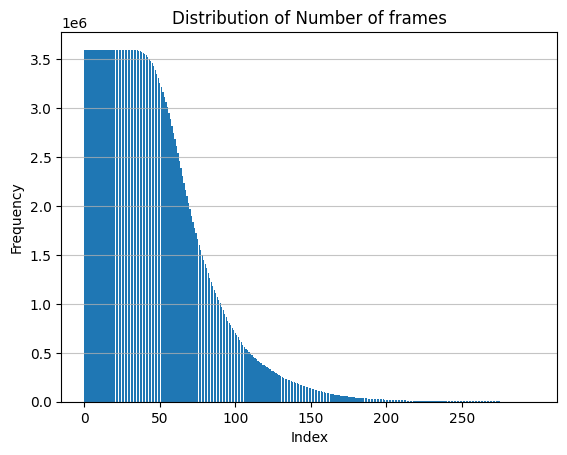

# UO-STGCN

*这是非常不稳定的研究性质代码*

## 数据处理

1. Get skeleton of each performer:`python get_raw_skes_data.py`
2. Remove the bad skeleton:`python get_raw_denoised_data.py`
3. Transform the skeleton to the center of the first frame：`python seq_transformation.py`

*使用300帧的原因是，存在的最大帧数为299*

*平均帧数为84.36*



#### Directory Structure
```
- data/
  - ntu/
  - ntu120/
  - nturgbd_raw/
    - nturgb+d_skeletons/     # from `nturgbd_skeletons_s001_to_s017.zip`
      ...
    - nturgb+d_skeletons120/  # from `nturgbd_skeletons_s018_to_s032.zip`
      ...
```

## 模型训练

注意：
1. `main_train.py`更名为`pretrain.py`
2. 默认启用了`checkpoint`机制,注意`checkpoint`只支持单阶段，例如预训练得到的权重只服务于预训练阶段，如果要将权重用到测试阶段，则必须使用`stgcn.pth`这样的权重
3. torchlight不再需要`pip install`，改写了代码使用文件直接链接
4. 默认将生成文件统一放入`runs`，包括测试生成的`.npy`文件等，当前我们仅考虑NTU60数据集，因此没有细化目录结构

**代码仍然在梳理中，对没有用到的代码也仍在简化**
